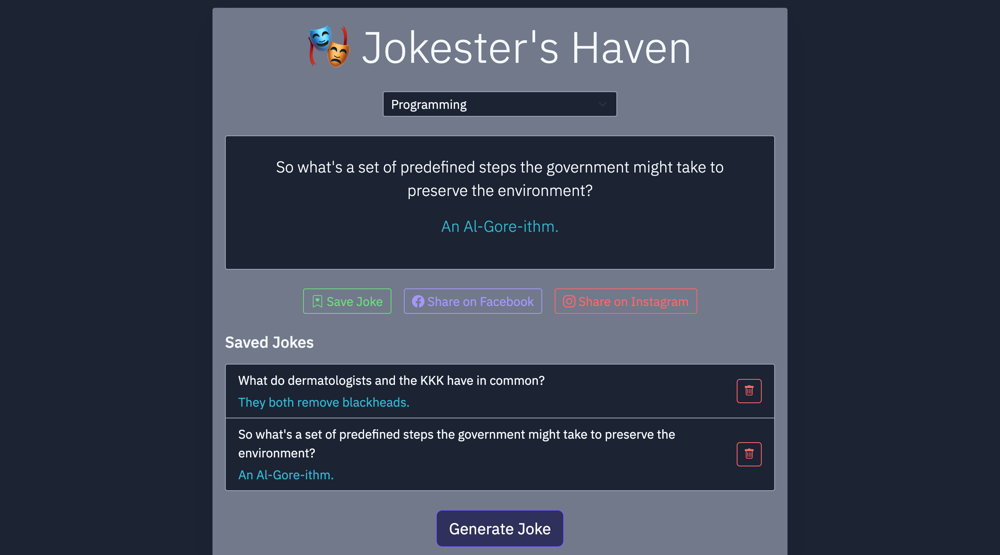
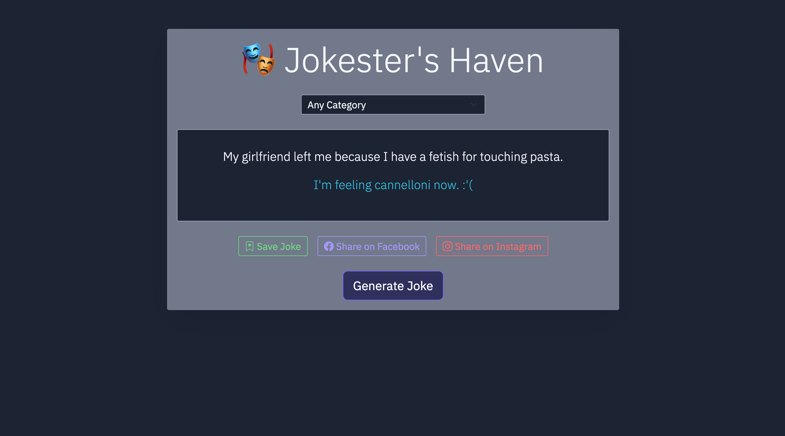
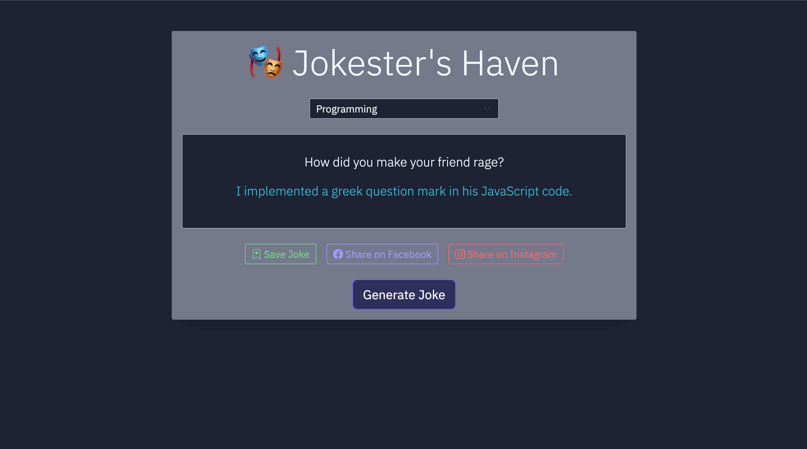
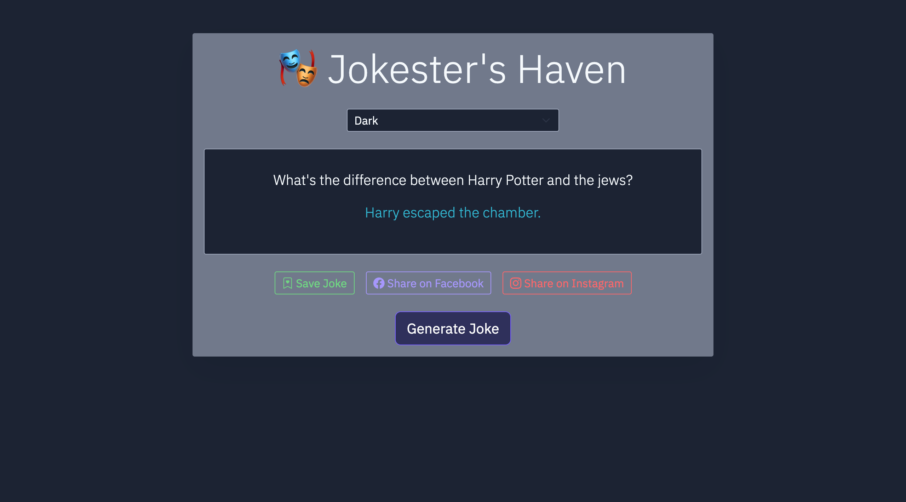
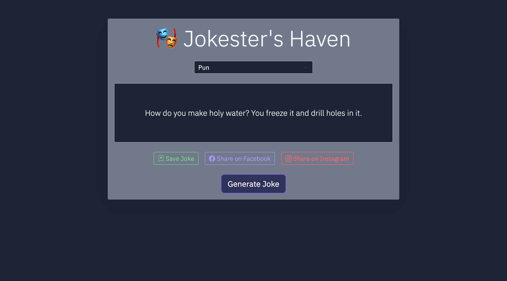
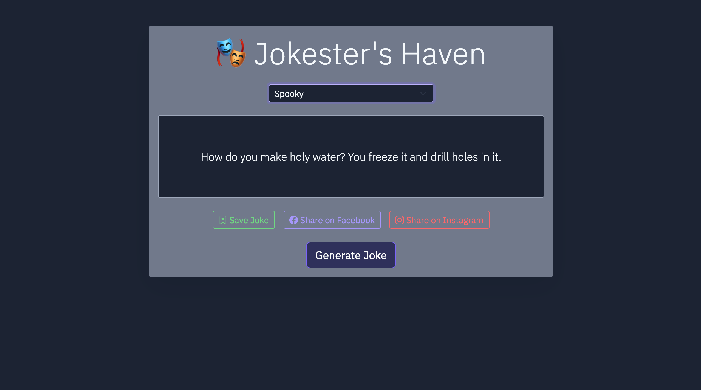
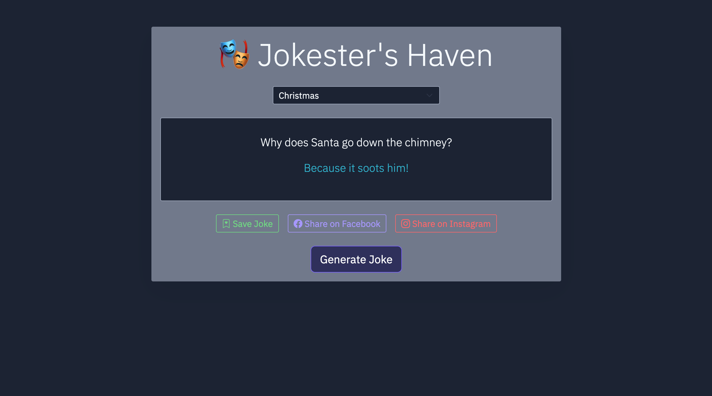

# Jokester's Haven

Jokester's Haven is a fun and interactive website that generates random jokes from different categories. Whether you need a quick laugh or want to share a joke with friends, this platform provides a seamless experience.

---

## 🌟 Features

- ✅ Generate random jokes from various categories.
- ✅ Supports both single-line and two-part (setup & punchline) jokes.
- ✅ Save favorite jokes to local storage for later viewing.
  
- ✅ Share jokes directly on Facebook and Instagram.
- ✅ Simple and user-friendly interface.

---

## 🎭 Joke Categories

Jokester's Haven allows you to generate jokes from the following categories:

- **Any** – A mix of all available categories.
- **Programming** – Jokes tailored for developers and tech enthusiasts.
- **Miscellaneous** – Random, light-hearted jokes from various topics.
- **Dark** – Jokes with a darker sense of humor.
- **Pun** – Wordplay-based jokes for pun lovers.
- **Spooky** – Halloween and horror-themed jokes.
- **Christmas** – Festive and holiday-themed jokes.

---

## 🚀 Technologies Used

- **Frontend:** HTML, CSS, JavaScript  
- **API:** [JokeAPI](https://v2.jokeapi.dev) for fetching jokes  
- **Local Storage:** Used for saving jokes  
- **Social Media Sharing:** Facebook and Instagram integration  

---

## 📸 Structure & Screenshots

The website follows a clean and minimal UI structure:

1. **Home Page:** Users can select a joke category and generate jokes.
2. **Generated Jokes:** Display area for single or two-part jokes.
3. **Save & Share:** Buttons to save jokes or share them on Facebook and Instagram.
4. **Saved Jokes Section:** List of jokes stored in local storage.

### 📷 Screenshots

- Any Category Joke Example
  

- Programming Joke Example  
  

- Miscellaneous Joke Example  
  

- Dark Humor Joke Example  
  

- Pun Joke Example  
  

- Spooky Joke Example  
  

- Christmas Joke Example  
  

---

## 🎉 How It Works

1. Select a joke category or choose 'Any' for a random joke.
2. Click the "Generate Joke" button to fetch a joke.
3. Save the joke or share it directly on social media.
4. View saved jokes anytime from the saved jokes section.

Enjoy the humor at **Jokester's Haven**! 😆  

